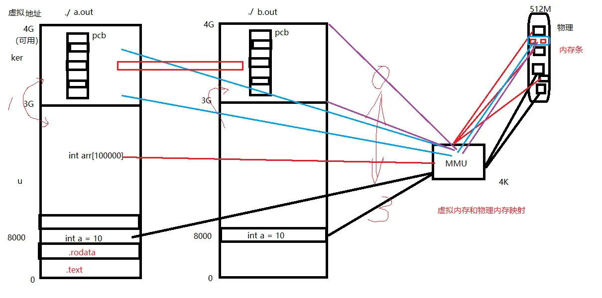
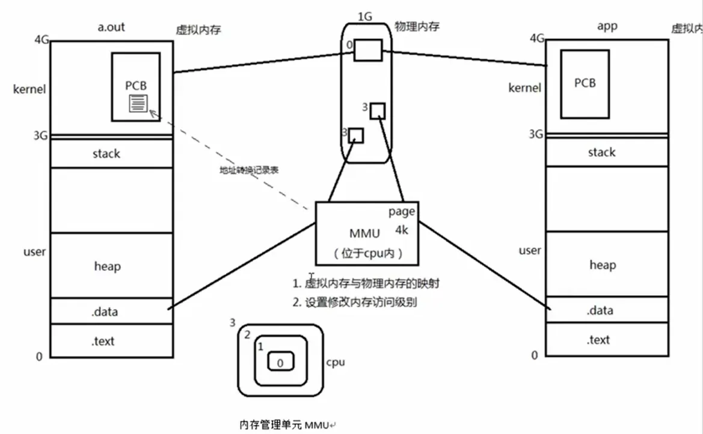
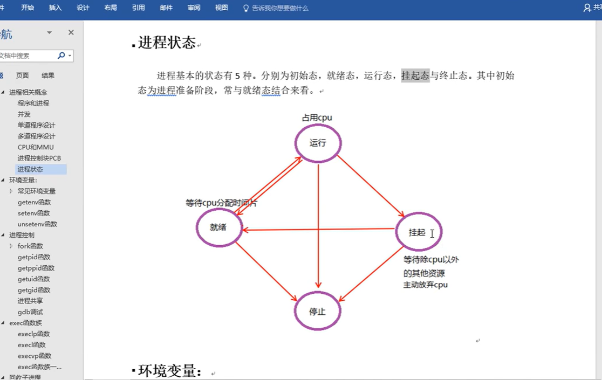
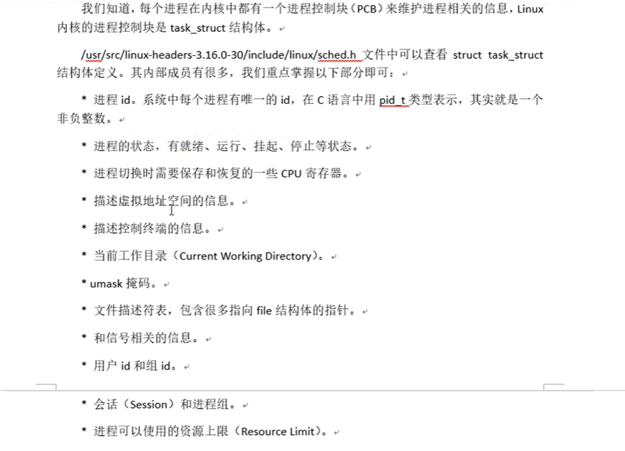
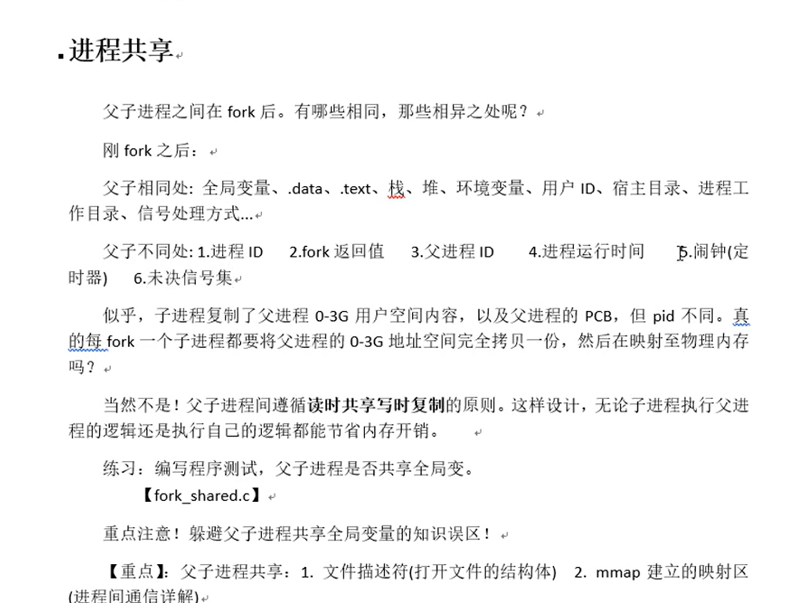
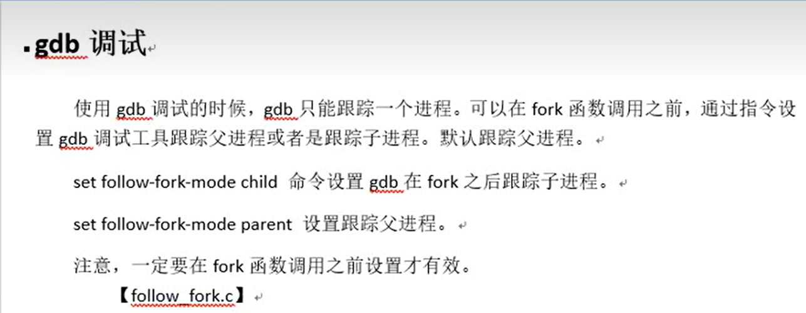
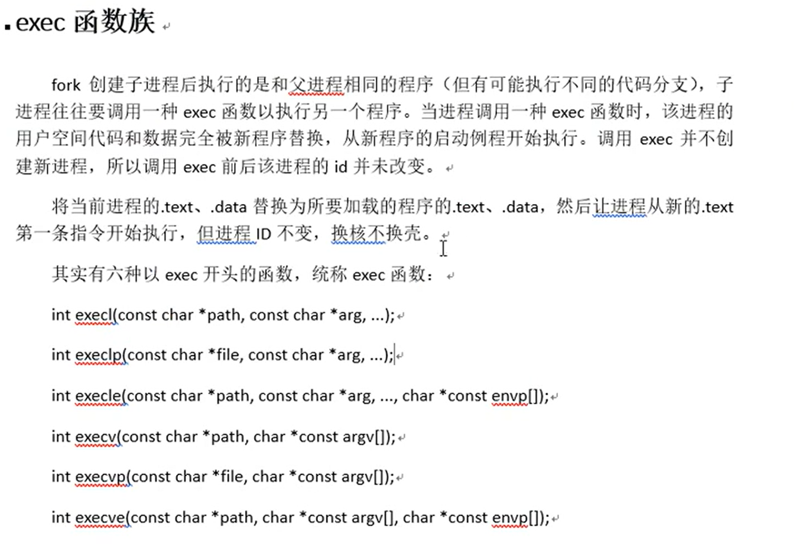
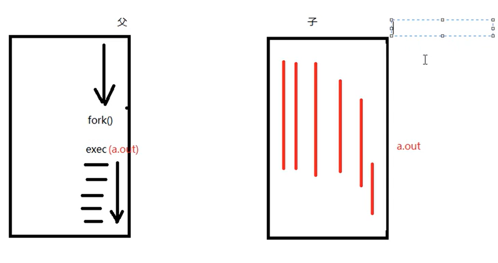

## 进程和PIC

## 目录

- [虚拟内存和物理内存的映射关系](#虚拟内存和物理内存的映射关系)
- [进程PCB内容](#进程pcb内容)
- [环境变量](#环境变量)
- [fork getpid getppid函数](#fork-getpid-getppid函数)
- [父子进程PCB的内容异同点](#父子进程pcb的内容异同点)
- [gdb调试命令设置跟踪那个父子进程](#gdb调试命令设置跟踪那个父子进程)
- [exec函数族](#exec函数族)
  - [execl() 函数](#execl-函数)
  - [execlp() 函数](#execlp-函数)
- [wait 和 waitpid 函数](#wait-和-waitpid-函数)
  - [wait() 函数](#wait-函数)
  - [waitpid() 函数](#waitpid-函数)
  - [status 状态解析函数详解](#status-状态解析函数详解)

---

#### 虚拟内存和物理内存的映射关系




MMU做地址映射，页面大小是4kB
内核空间是共享的，因为内核只有一个，而a.out的内核pcb数据和b.out的内核pcb数据可以映射到一个页面，但是二者不能重叠覆盖。这就相当于内核程序（操作系统）中的数据映射到一个页面。


#### 进程PCB内容
进程的五种状态((初始态), 运行态,就绪态,挂起态,终止态)


需要记住的有 进程ID 进程状态 当前工作目录 文件描述符表 用户id和组id 和信号相关的信息(后面会慢慢了解)

#### 环境变量
常用的环境变量有 PATH, SHELL,TERM,LANG,HOME
使用`echo ${环境变量的名称}`

#### `fork` `getpid` `getppid`函数

**包含的头文件：**
```c
#include <sys/types.h> 
#include <unistd.h>
```

**功能：**
- `fork()` 函数用于创建子进程

**返回值：**
- **成功时：**
  - 在子进程中返回 `0`
  - 在父进程中返回子进程的 `pid`（进程ID）
- **失败时：**
  - 返回 `-1`

---

**`getpid()` 函数**

**功能：**
- 获取当前进程的进程ID（Process ID）

**返回值：**
- 总是成功，返回当前进程的 `pid`（类型为 `pid_t`）

**示例：**
```c
pid_t pid = getpid();
printf("当前进程ID: %d\n", pid);
```
---

**`getppid()` 函数**

**功能：**
- 获取当前进程的父进程ID（Parent Process ID）

**返回值：**
- 总是成功，返回当前进程的父进程 `pid`（类型为 `pid_t`）

**示例：**
```c
pid_t ppid = getppid();
printf("父进程ID: %d\n", ppid);
```

#### 父子进程PCB的内容异同点


- 注意**这里的相同点是指当fork函数执行成功之后, 那一时刻父子进程相同的部分,但是后续并不能保证两个进程是共享这些数据和信息的!**
重点关注不同点: 进程ID, fork返回值, 父进程ID, 进程运行时间, 闹钟(定时器), 未决信号集.
- 父子进程间遵循 `读时共享写时复制`的规则, 注意**父子进程是不共享全局变量的, 当子进程开始修改父进程的全局变量或者栈内的局部变量的时候, 这时候会将这些变量复制一份给自己用.所以二者是不共享全局变量的!!**
- 但是父子进程也会共享两样东西一个是 文件描述符, 另一个是mmap建立的映射区(用于进程间通信)


#### gdb调试命令设置跟踪那个父子进程

主要有两个设置参数, 当然这里我也不怎么用`gdb`就先不细究了

#### exec函数族

> 最重要的就是前两个函数, `execl` 和 `execlp`

在使用`fork`函数之后,在子程序内部使用`exec`类型的函数,会将子程序的后续的代码覆盖掉,被`exec`函数调用的程序内容覆盖掉, `execl`函数执行之后也不会返回到调用处执行后续代码,而是在调用结束后直接退出。
在这个过程当中，子进程的`PID`不变，但是执行的内容变量。

---

**`execl()` 函数**

**包含的头文件：**
```c
#include <unistd.h>
```

**函数原型：**
```c
int execl(const char *path, const char *arg, ... /* (char  *) NULL */);
```

**功能：**
- 执行指定的可执行文件，用新程序替换当前进程的映像
- `execl` 使用**完整路径**来指定要执行的程序
- 参数列表以 `NULL` 结尾

**参数说明：**
- `path`: 要执行的可执行文件的**完整路径**（如 `/bin/ls`, `/usr/bin/ps`）
- `arg`: 程序的名称（通常是 `argv[0]`，可以是程序名本身）
- `...`: 可变参数列表，传递命令行参数，**必须以 `NULL` 结尾**

**返回值：**
- **成功时：** 不返回（因为当前进程被新程序替换）
- **失败时：** 返回 `-1`，并设置 `errno`

**示例程序：**
```c
#include <stdio.h>
#include <unistd.h>
#include <sys/types.h>

int main() {
    pid_t pid = fork();
    
    if (pid == 0) {
        // 子进程：执行 ls -l /tmp 命令
        printf("子进程准备执行 ls 命令\n");
        execl("/bin/ls", "ls", "-l", "/tmp", NULL);
        
        // 如果 execl 失败，才会执行到这里
        perror("execl 执行失败");
        return 1;
    } else if (pid > 0) {
        // 父进程
        printf("父进程等待子进程执行完毕\n");
        wait(NULL);  // 等待子进程结束
        printf("子进程执行完毕\n");
    } else {
        perror("fork 失败");
        return 1;
    }
    
    return 0;
}
```

**示例说明：**
- 使用 `execl("/bin/ls", "ls", "-l", "/tmp", NULL)` 执行 `ls -l /tmp` 命令
- 第一个参数是完整路径 `/bin/ls`
- 第二个参数是程序名 `"ls"`
- 后续参数是命令行参数 `"-l"` 和 `"/tmp"`
- 最后必须以 `NULL` 结尾

---

**`execlp()` 函数**

**包含的头文件：**
```c
#include <unistd.h>
```

**函数原型：**
```c
int execlp(const char *file, const char *arg, ... /* (char  *) NULL */);
```

**功能：**
- 执行指定的可执行文件，用新程序替换当前进程的映像
- `execlp` 会在 **PATH 环境变量**指定的目录中搜索要执行的程序
- 参数列表以 `NULL` 结尾
- **`p` 表示 PATH**，即自动搜索 PATH 环境变量

**参数说明：**
- `file`: 要执行的文件名（不需要完整路径，会在 PATH 中搜索）
- `arg`: 程序的名称（通常是 `argv[0]`，可以是程序名本身）
- `...`: 可变参数列表，传递命令行参数，**必须以 `NULL` 结尾**

**返回值：**
- **成功时：** 不返回（因为当前进程被新程序替换）
- **失败时：** 返回 `-1`，并设置 `errno`

**示例程序：**
```c
#include <stdio.h>
#include <unistd.h>
#include <sys/types.h>

int main() {
    pid_t pid = fork();
    
    if (pid == 0) {
        // 子进程：执行 ps aux 命令
        // 注意：只需要程序名，不需要完整路径
        printf("子进程准备执行 ps 命令\n");
        execlp("ps", "ps", "aux", NULL);
        
        // 如果 execlp 失败，才会执行到这里
        perror("execlp 执行失败");
        return 1;
    } else if (pid > 0) {
        // 父进程
        printf("父进程等待子进程执行完毕\n");
        wait(NULL);  // 等待子进程结束
        printf("子进程执行完毕\n");
    } else {
        perror("fork 失败");
        return 1;
    }
    
    return 0;
}
```

**示例说明：**
- 使用 `execlp("ps", "ps", "aux", NULL)` 执行 `ps aux` 命令
- 只需要提供程序名 `"ps"`，系统会在 PATH 环境变量中搜索
- 不需要知道 `ps` 命令的完整路径（如 `/usr/bin/ps`）

---

**`execl` 和 `execlp` 的区别：**

| 特性 | `execl` | `execlp` |
|------|---------|----------|
| 路径要求 | 需要**完整路径** | 只需要**程序名**（在 PATH 中搜索） |
| 使用场景 | 知道程序的完整路径 | 程序在 PATH 环境变量中 |
| 示例 | `execl("/bin/ls", "ls", "-l", NULL)` | `execlp("ls", "ls", "-l", NULL)` |
| 灵活性 | 可以执行任意路径的程序 | 只能执行 PATH 中的程序 |

**注意事项：**
1. 两个函数的参数列表都**必须以 `NULL` 结尾**
2. 执行成功后，**不会返回到调用处**，当前进程的代码被新程序替换
3. 如果执行失败，会返回 `-1`，可以通过 `perror()` 查看错误信息
4. 通常与 `fork()` 配合使用，在子进程中调用 `exec` 函数族

---

#### wait 和 waitpid 函数

**包含的头文件：**
```c
#include <sys/types.h>
#include <sys/wait.h>
```

这两个函数用于父进程等待子进程结束，并回收子进程资源，避免产生僵尸进程。
孤儿进程
- 父进程先于子进程结束，子进程沦为"孤儿进程"，会被`init`进程领养。

僵尸进程：
- 子进程终止，父进程尚未对子进程进行回收，在此期间，子进程为“僵尸进程”。  kill 对其无效。这里要注意，**每个进程结束后都必然会经历僵尸态，时间长短的差别而已。**
- 子进程终止时，子进程残留资源PCB存放于内核中，PCB记录了进程结束原因，进程回收就是回收PCB。回收僵尸进程，得kill它的父进程，让孤儿院去回收它。
 
`wait()`和`waitpid()`两个函数，每次调用都只会回收一个子进程，但是`waitpid()`功能更加强大一些，可以非阻塞回收进程，当调用`waitpid()`且设置非阻塞`WNOHANG`会在没有子进程可回收的时候返回0，在有子进程回收的时候返回子进程的`pid`，发生错误的时候返回`-1`,处理`errno`。 

---

**`wait()` 函数**

**函数原型：**
```c
pid_t wait(int *status);
```

**功能：**
- 等待**任意一个**子进程结束
- 阻塞调用进程，直到有一个子进程结束
- 回收子进程资源，防止产生僵尸进程
- 获取子进程的退出状态

**参数说明：**
- `status`: 用于存储子进程退出状态的指针
  - 如果为 `NULL`，则不获取退出状态
  - 如果不为 `NULL`，可以通过宏函数获取退出信息：
    - `WIFEXITED(status)`: 判断子进程是否正常退出
    - `WEXITSTATUS(status)`: 获取子进程的退出码（仅在正常退出时有效）
    - `WIFSIGNALED(status)`: 判断子进程是否被信号终止
    - `WTERMSIG(status)`: 获取终止子进程的信号编号

**返回值：**
- **成功时：** 返回已结束的子进程的 `pid`
- **失败时：** 返回 `-1`，并设置 `errno`（如没有子进程时返回 `-1`）

**示例程序：**
```c
#include <stdio.h>
#include <stdlib.h>
#include <unistd.h>
#include <sys/types.h>
#include <sys/wait.h>

int main() {
    pid_t pid = fork();
    
    if (pid == 0) {
        // 子进程
        printf("子进程开始执行，PID: %d\n", getpid());
        sleep(2);  // 模拟子进程执行
        printf("子进程执行完毕，准备退出\n");
        exit(10);  // 子进程退出，退出码为 10
    } else if (pid > 0) {
        // 父进程
        int status;
        printf("父进程等待子进程结束，子进程PID: %d\n", pid);
        
        pid_t child_pid = wait(&status);  // 等待子进程结束
        
        if (child_pid == -1) {
            perror("wait 失败");
            return 1;
        }
        
        printf("子进程 %d 已结束\n", child_pid);
        
        // 检查子进程退出状态
        if (WIFEXITED(status)) {
            printf("子进程正常退出，退出码: %d\n", WEXITSTATUS(status));
        } else if (WIFSIGNALED(status)) {
            printf("子进程被信号终止，信号编号: %d\n", WTERMSIG(status));
        }
        
        printf("父进程继续执行\n");
    } else {
        perror("fork 失败");
        return 1;
    }
    
    return 0;
}
```

**示例说明：**
- 父进程调用 `wait(&status)` 阻塞等待子进程结束
- 子进程执行完毕后，父进程获取子进程的退出状态
- 使用 `WIFEXITED()` 和 `WEXITSTATUS()` 检查退出码

---

**`waitpid()` 函数**

**函数原型：**
```c
pid_t waitpid(pid_t pid, int *status, int options);
```

**功能：**
- 等待**指定的子进程**或**任意子进程**结束
- 比 `wait()` 更灵活，可以指定等待哪个子进程
- 可以设置为非阻塞模式

**参数说明：**
- `pid`: 要等待的子进程ID
  - `> 0`: 等待指定 PID 的子进程
  - `-1`: 等待任意子进程（等同于 `wait()`）
  - `0`: **等待与调用进程同组ID的任意子进程**
  - `< -1`: 等待组ID等于 `|pid|` 的任意子进程
- `status`: 用于存储子进程退出状态的指针（同 `wait()`）
- `options`: 控制函数行为的选项（可以组合使用）
  - `0`: 默认行为，阻塞等待
  - `WNOHANG`: 非阻塞模式，如果没有子进程结束，立即返回 `0`
  - `WUNTRACED`: 如果子进程被暂停，也返回（用于调试）

**返回值：**
- **成功时：** 返回已结束的子进程的 `pid` (大于0)
- **如果使用 `WNOHANG` 且没有子进程结束：** 返回 `0`
- **失败时：** 返回 `-1`，并设置 `errno`

**示例程序1：等待指定子进程**
```c
#include <stdio.h>
#include <stdlib.h>
#include <unistd.h>
#include <sys/types.h>
#include <sys/wait.h>

int main() {
    pid_t pid1, pid2;
    int status;
    
    // 创建第一个子进程
    pid1 = fork();
    if (pid1 == 0) {
        printf("子进程1开始执行，PID: %d\n", getpid());
        sleep(3);
        printf("子进程1执行完毕\n");
        exit(1);
    }
    
    // 创建第二个子进程
    pid2 = fork();
    if (pid2 == 0) {
        printf("子进程2开始执行，PID: %d\n", getpid());
        sleep(1);
        printf("子进程2执行完毕\n");
        exit(2);
    }
    
    // 父进程：先等待第二个子进程（先结束的）
    printf("父进程等待子进程2 (PID: %d)\n", pid2);
    waitpid(pid2, &status, 0);
    if (WIFEXITED(status)) {
        printf("子进程2已结束，退出码: %d\n", WEXITSTATUS(status));
    }
    
    // 再等待第一个子进程
    printf("父进程等待子进程1 (PID: %d)\n", pid1);
    waitpid(pid1, &status, 0);
    if (WIFEXITED(status)) {
        printf("子进程1已结束，退出码: %d\n", WEXITSTATUS(status));
    }
    
    printf("所有子进程都已结束\n");
    return 0;
}
```

**示例程序2：非阻塞模式（WNOHANG）**
```c
#include <stdio.h>
#include <stdlib.h>
#include <unistd.h>
#include <sys/types.h>
#include <sys/wait.h>

int main() {
    pid_t pid = fork();
    
    if (pid == 0) {
        // 子进程
        printf("子进程开始执行，PID: %d\n", getpid());
        sleep(5);  // 子进程执行5秒
        printf("子进程执行完毕\n");
        exit(0);
    } else if (pid > 0) {
        // 父进程：使用非阻塞模式轮询
        int status;
        pid_t result;
        
        printf("父进程开始轮询等待子进程\n");
        
        while (1) {
            result = waitpid(pid, &status, WNOHANG);
            
            if (result == -1) {
                perror("waitpid 失败");
                break;
            } else if (result == 0) {
                // 子进程还未结束
                printf("子进程还在运行，父进程继续做其他事情...\n");
                sleep(1);
            } else {
                // 子进程已结束
                printf("子进程 %d 已结束\n", result);
                if (WIFEXITED(status)) {
                    printf("子进程正常退出，退出码: %d\n", WEXITSTATUS(status));
                }
                break;
            }
        }
        
        printf("父进程继续执行\n");
    } else {
        perror("fork 失败");
        return 1;
    }
    
    return 0;
}
```

---

#### status 状态解析函数详解

`wait()` 和 `waitpid()` 函数返回的 `status` 参数包含了子进程的退出信息，需要使用以下宏函数来解析。这些宏函数定义在 `<sys/wait.h>` 头文件中。

**常用的 status 解析宏函数：**

| 宏函数 | 功能 | 返回值 |
|--------|------|--------|
| `WIFEXITED(status)` | 判断子进程是否**正常退出**（通过 `exit()` 或 `return`） | 非0表示正常退出，0表示异常退出 |
| `WEXITSTATUS(status)` | 获取子进程的**退出码**（0-255） | 仅在 `WIFEXITED(status)` 为真时有效 |
| `WIFSIGNALED(status)` | 判断子进程是否被**信号终止** | 非0表示被信号终止，0表示不是 |
| `WTERMSIG(status)` | 获取终止子进程的**信号编号** | 仅在 `WIFSIGNALED(status)` 为真时有效 |
| `WIFSTOPPED(status)` | 判断子进程是否被**暂停**（用于调试） | 非0表示被暂停 |
| `WSTOPSIG(status)` | 获取暂停子进程的信号编号 | 仅在 `WIFSTOPPED(status)` 为真时有效 |
| `WCOREDUMP(status)` | 判断子进程是否产生了**核心转储文件** | 非0表示产生了 core dump |

**详细说明：**

**1. `WIFEXITED(status)` 和 `WEXITSTATUS(status)`**

用于检查子进程是否正常退出并获取退出码。

```c
int status;
pid_t pid = wait(&status);

if (WIFEXITED(status)) {
    // 子进程正常退出
    int exit_code = WEXITSTATUS(status);
    printf("子进程正常退出，退出码: %d\n", exit_code);
    
    if (exit_code == 0) {
        printf("子进程执行成功\n");
    } else {
        printf("子进程执行失败，退出码: %d\n", exit_code);
    }
}
```

**使用场景：**
- 子进程通过 `exit(0)` 或 `exit(非0值)` 退出
- 子进程在 `main()` 函数中 `return` 退出
- 需要检查子进程的执行结果（成功/失败）

**2. `WIFSIGNALED(status)` 和 `WTERMSIG(status)`**

用于检查子进程是否被信号终止并获取信号编号。

```c
int status;
pid_t pid = wait(&status);

if (WIFSIGNALED(status)) {
    // 子进程被信号终止
    int sig_num = WTERMSIG(status);
    printf("子进程被信号终止，信号编号: %d\n", sig_num);
    
    // 常见信号编号
    switch(sig_num) {
        case SIGTERM:  // 15 - 终止信号
            printf("子进程收到 SIGTERM 信号\n");
            break;
        case SIGKILL:  // 9 - 强制终止
            printf("子进程被强制终止 (SIGKILL)\n");
            break;
        case SIGSEGV:  // 11 - 段错误
            printf("子进程发生段错误 (SIGSEGV)\n");
            break;
        default:
            printf("子进程被信号 %d 终止\n", sig_num);
    }
    
    // 检查是否产生 core dump
    if (WCOREDUMP(status)) {
        printf("子进程产生了核心转储文件 (core dump)\n");
    }
}
```

**使用场景：**
- 子进程因为段错误、除零等异常被系统终止
- 子进程被 `kill` 命令或其他进程发送信号终止
- 调试程序崩溃问题

**3. `WIFSTOPPED(status)` 和 `WSTOPSIG(status)`**

用于检查子进程是否被暂停（通常用于调试）。

```c
int status;
pid_t pid = waitpid(child_pid, &status, WUNTRACED);

if (WIFSTOPPED(status)) {
    int sig_num = WSTOPSIG(status);
    printf("子进程被暂停，信号编号: %d\n", sig_num);
    // 通常用于调试器暂停进程
}
```

**使用场景：**
- 使用调试器（如 gdb）调试子进程
- 需要检测子进程是否被暂停

**完整示例：综合使用所有状态解析函数**

```c
#include <stdio.h>
#include <stdlib.h>
#include <unistd.h>
#include <sys/types.h>
#include <sys/wait.h>
#include <signal.h>

void print_child_status(int status) {
    if (WIFEXITED(status)) {
        // 正常退出
        int exit_code = WEXITSTATUS(status);
        printf("✓ 子进程正常退出，退出码: %d\n", exit_code);
        
        if (exit_code == 0) {
            printf("  → 子进程执行成功\n");
        } else {
            printf("  → 子进程执行失败，退出码: %d\n", exit_code);
        }
    } else if (WIFSIGNALED(status)) {
        // 被信号终止
        int sig_num = WTERMSIG(status);
        printf("✗ 子进程被信号终止，信号编号: %d", sig_num);
        
        // 常见信号说明
        switch(sig_num) {
            case SIGTERM: printf(" (SIGTERM - 终止信号)\n"); break;
            case SIGKILL: printf(" (SIGKILL - 强制终止)\n"); break;
            case SIGSEGV: printf(" (SIGSEGV - 段错误)\n"); break;
            case SIGINT:  printf(" (SIGINT - 中断信号，Ctrl+C)\n"); break;
            case SIGQUIT: printf(" (SIGQUIT - 退出信号，Ctrl+\\)\n"); break;
            default: printf("\n"); break;
        }
        
        if (WCOREDUMP(status)) {
            printf("  → 产生了核心转储文件 (core dump)\n");
        }
    } else if (WIFSTOPPED(status)) {
        // 被暂停
        int sig_num = WSTOPSIG(status);
        printf("⏸ 子进程被暂停，信号编号: %d\n", sig_num);
    } else {
        printf("? 未知的退出状态\n");
    }
}

int main() {
    pid_t pid;
    int status;
    
    // 示例1：正常退出
    printf("=== 示例1：子进程正常退出 ===\n");
    pid = fork();
    if (pid == 0) {
        exit(0);  // 正常退出，退出码为 0
    } else {
        wait(&status);
        print_child_status(status);
    }
    
    printf("\n");
    
    // 示例2：异常退出（非0退出码）
    printf("=== 示例2：子进程异常退出（退出码非0） ===\n");
    pid = fork();
    if (pid == 0) {
        exit(42);  // 正常退出，但退出码为 42（表示错误）
    } else {
        wait(&status);
        print_child_status(status);
    }
    
    printf("\n");
    
    // 示例3：被信号终止
    printf("=== 示例3：子进程被信号终止 ===\n");
    pid = fork();
    if (pid == 0) {
        // 子进程自己发送 SIGTERM 信号给自己（仅作演示）
        raise(SIGTERM);
    } else {
        wait(&status);
        print_child_status(status);
    }
    
    return 0;
}
```

**状态判断的典型流程：**

```c
int status;
pid_t pid = wait(&status);

if (WIFEXITED(status)) {
    // 情况1：正常退出
    int exit_code = WEXITSTATUS(status);
    // 处理退出码
} else if (WIFSIGNALED(status)) {
    // 情况2：被信号终止
    int sig_num = WTERMSIG(status);
    // 处理信号终止
    if (WCOREDUMP(status)) {
        // 检查是否产生 core dump
    }
} else if (WIFSTOPPED(status)) {
    // 情况3：被暂停（调试场景）
    int sig_num = WSTOPSIG(status);
    // 处理暂停状态
}
```

**注意事项：**
1. **必须先判断退出类型，再获取具体值**
   - 错误示例：`int code = WEXITSTATUS(status);` （如果子进程被信号终止，这个值无意义）
   - 正确示例：先 `WIFEXITED(status)` 判断，再 `WEXITSTATUS(status)` 获取

2. **退出码范围：0-255**
   - `exit(256)` 会被截断为 `exit(0)`
   - 通常约定：0 表示成功，非0 表示失败

3. **信号编号**
   - 常见信号：`SIGTERM(15)`, `SIGKILL(9)`, `SIGSEGV(11)`, `SIGINT(2)`
   - 可以使用 `strsignal(sig_num)` 获取信号名称字符串

---

**`wait()` 和 `waitpid()` 的区别：**

| 特性 | `wait()` | `waitpid()` |
|------|----------|-------------|
| 等待目标 | 任意子进程 | 可以指定子进程 |
| 阻塞模式 | 只能阻塞 | 可以非阻塞（使用 `WNOHANG`） |
| 灵活性 | 较低 | 较高 |
| 使用场景 | 简单场景，等待任意子进程 | 需要等待特定子进程或非阻塞等待 |

**注意事项：**
1. **必须调用 `wait()` 或 `waitpid()` 回收子进程**，否则会产生僵尸进程
2. 如果父进程先于子进程结束，子进程会成为孤儿进程，被 `init` 进程（PID=1）收养
3. 使用 `WNOHANG` 选项可以实现非阻塞等待，适合需要同时处理其他任务的场景
4. 退出状态信息需要使用宏函数（如 `WIFEXITED`、`WEXITSTATUS`）来解析
5. `exit(10)` 和 `return 10` 有区别吗？
- 分两种情况：

    - 情况 A：在 main 函数中
        - 基本没区别。
        在 main 函数里执行 `return 10;`，C 语言的启动代码（Startup Code）捕获到这个返回值后，会自动调用 `exit(10)`。
        效果：进程结束，并把 10 作为退出码留给父进程。

    - 情况 B：在非 main 函数（自定义函数）中
        - 区别巨大！
        `return 10`;：只是退出当前函数，返回到调用它的上一层函数，进程继续活着。
        `exit(10)`：原地终止整个进程。不管你在多深的函数堆栈里，直接清理资源、关灯走人。

**建议： 在子进程的代码逻辑里，为了表达“在这个地方终止子进程”，建议显式使用 exit(10)，这样代码意图更清晰。**